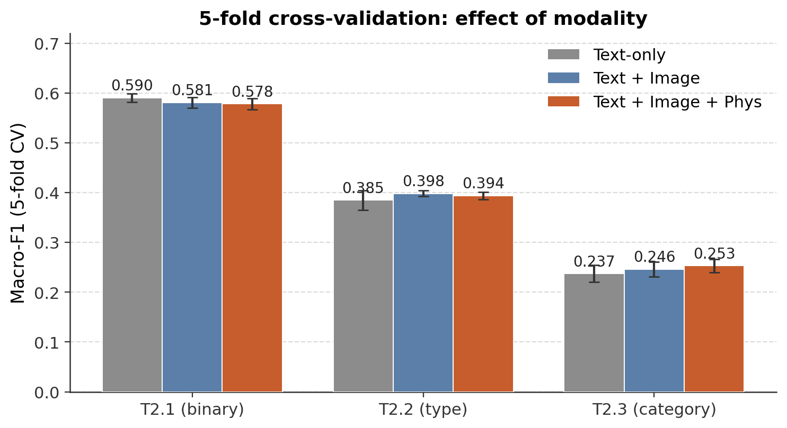

# Multimodal Sexism Identification in Memes

Detecting and characterising sexism in memes by combining **text**, **image**,
and **physiological sensor signals** (eye-tracking, EEG, heart-rate). Built for
the [**EXIST 2026**](https://nlp.uned.es/exist2026/) shared task (Task 2 -
memes), covering all three subtasks:

| Subtask | Goal | Type |
|--------|------|------|
| **2.1** | Is the meme sexist? | Binary — `YES` / `NO` |
| **2.2** | What kind of sexism? | 3-class — `NO` / `DIRECT` / `JUDGEMENTAL` |
| **2.3** | Which categories of sexism? | Multi-label — 5 categories |

> **The core research question:** do biometric reactions from people *viewing*
> a meme (where their eyes go, pupil dilation, EEG, heart-rate) carry signal
> about whether that meme is sexist - on top of the text and image themselves?

📄 **[Project slides](docs/presentation.pdf)** · **[Full report](docs/report.pdf)**

---

## Approach

Each subtask uses an [XLM-RoBERTa](https://arxiv.org/abs/1911.02116) text
backbone (multilingual: the memes are English + Spanish), tailored per task and
combined with the other modalities via **late fusion**.

```
text                          ->  XLM-RoBERTa (fine-tuned)  ->  P_text
image + sensors (ET/EEG/HR)   ->  LogReg                    ->  P_sensor

final = alpha * P_text + (1 - alpha) * P_sensor       (alpha swept on validation)
```

| Subtask | Model | Key techniques |
|--------|-------|----------------|
| **2.1** | XLM-R **large**, full fine-tune | Class-weighted loss · late fusion with image + sensor LogReg · α-sweep |
| **2.2** | XLM-R **large** + **LoRA** | Minority **oversampling** · **focal loss** (γ=2) · late fusion |
| **2.3** | XLM-R **base**, full fine-tune | Multi-label `BCEWithLogitsLoss` (one sigmoid per category) |

Both **hard** labels (majority vote) and **soft** labels (annotator
distributions) are produced for every subtask, matching the EXIST learning-with-
disagreement evaluation.

---

## Results

### Does multimodality help? (5-fold CV, macro-F1)

The headline ablation - text alone vs. adding image vs. adding physiological
signals - from [`project/cv_phys_results.json`](project/cv_phys_results.json):

| Modalities            | Task 2.1 | Task 2.2 | Task 2.3 |
|-----------------------|:--------:|:--------:|:--------:|
| Text only             |  0.590   |  0.385   |  0.237   |
| Text + Image          |  0.581   |  0.398   |  0.246   |
| **Text + Image + Phys** |  0.578   | **0.394**| **0.253**|

**Finding (honest):** physiological + image signals give a small but consistent
lift on the harder, fine-grained subtasks (2.2 type, 2.3 categories), while
binary detection (2.1) is already well-served by text alone. Biometric reactions
help most exactly where the *language* is ambiguous.



### Best single-task model

The submission model for Task 2.1 (XLM-R large + image/sensor late fusion,
α≈0.95) reaches **val macro-F1 ≈ 0.81**.

---

## Repository structure

```
project/
├── task2_1_yesno.py        # Subtask 2.1 - binary (XLM-R large + late fusion)
├── task2_2_type.py         # Subtask 2.2 - type   (XLM-R large + LoRA + focal loss)
├── task2_3_category.py     # Subtask 2.3 - multi-label categories
├── train_baselines.py      # Vanilla XLM-R-base baselines for all 3 subtasks
├── regen_figures.py        # Rebuild result figures
├── make_arch_figure.py     # Architecture diagram
├── src/
│   ├── config.py           # Paths, label sets, team constants
│   └── data_utils.py        # JSON loading + hard/soft label construction
├── figures/                # Result & architecture figures (PNG)
└── runs/                   # Example submission files (hard + soft, per task)
docs/
├── presentation.pdf        # Project slides
└── report.pdf              # Project write-up
```

> **Not in the repo:** the dataset, extracted features, and trained weights are
> intentionally excluded (license + privacy + size). See **[DATA.md](DATA.md)**.

---

## Running it

```bash
# 1. Install dependencies
pip install -r requirements.txt

# 2. Obtain the EXIST 2026 data and place it as described in DATA.md,
#    then generate the feature files into project/features/

# 3. Train a subtask model (writes weights to project/models/,
#    submissions to project/runs/)
python project/task2_1_yesno.py
python project/task2_2_type.py
python project/task2_3_category.py
```

A CUDA GPU is recommended - the 2.1/2.2 models fine-tune XLM-R-large
(bf16, gradient checkpointing).

---

## Data, ethics & licensing

- **Code** in this repo is released under the [MIT License](LICENSE).
- The **EXIST 2026 dataset is *not* included** and is *not* redistributable. It
  contains sensitive biometric and demographic data; request access from the
  organizers. See **[DATA.md](DATA.md)**.
- This project is intended for **research on detecting sexism** in order to study
  and mitigate online harm.

---

*Author: Klaudia Banasiewicz · EXIST 2026 shared task (Task 2 - memes).*
